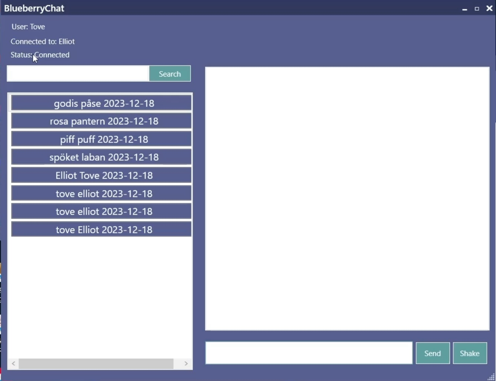
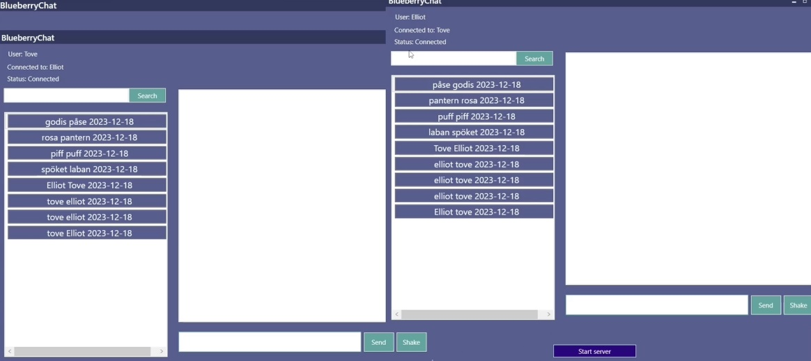

# BlueberryChat P2P application

BlueberryChat is a P2P application built using C# and .NET to make connections, message, store and read old messages. This was built during the course TDDD49 and is a prototype and would need work to reach public addresses and touch up the UI elements of the application. The Application was built using MVVM and implements its core features for the structure. 

## Run

To run Blueberrychat head into the root\ChatApp\ChatApp\ChatApp\bin\Debug\net7.0-windows.

Or

Run the app using the Visual Studio run functionality.

## Preview

Closeup of the UI

Server and client connected
